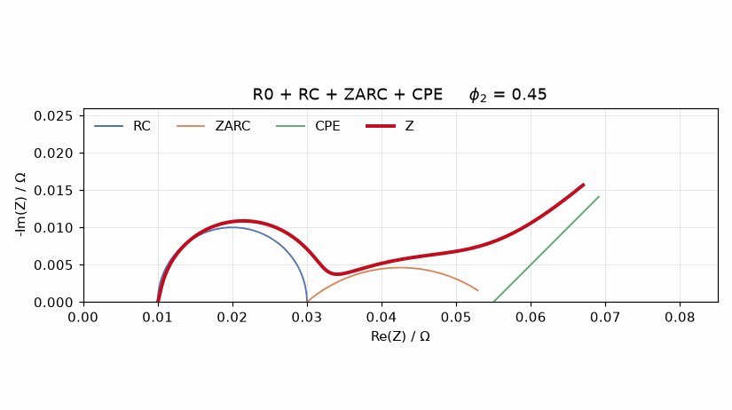

# Interactive impedance spectra

Equivalent-circuit model of a lithium-ion cell, plotted as a Nyquist diagram you
can pull apart with sliders — to build intuition for which circuit element is
responsible for which feature of a measured spectrum.



## Background

Electrochemical impedance spectroscopy (EIS) characterises a battery cell
without taking it apart: excite it with a small sinusoidal current across many
decades of frequency, record the complex impedance, and plot `-Im(Z)` over
`Re(Z)`. Processes inside the cell separate out along the curve, because each
has its own characteristic time constant.

Fitting such a spectrum means choosing an equivalent circuit and identifying its
parameters. That only works if you know what each parameter does to the curve —
which is exactly what is hard to see in a table of fit results and easy to see
on a slider.

## The model

$$\underline{Z} = R_0
 + \frac{1}{\frac{1}{R_1} + j\omega C_1}
 + \frac{1}{\frac{1}{R_2} + A_2(j\omega)^{\phi_2}}
 + \frac{1}{A_3(j\omega)^{\phi_3}}$$

| Element | Represents | Nyquist signature |
| --- | --- | --- |
| $R_0$ | ohmic resistance of collectors, electrolyte, contacts | offset along the real axis |
| $R_1 \parallel C_1$ (RC) | charge transfer with an ideal double layer | perfect semicircle |
| $R_2 \parallel \mathrm{CPE}_2$ (ZARC) | charge transfer with a distributed time constant | semicircle depressed by $\phi_2$ |
| $\mathrm{CPE}_3$ | diffusion-like low-frequency behaviour | straight tail at $\phi_3 \cdot 90°$ |

The constant phase element $Z = 1/(A(j\omega)^{\phi})$ carries the generality:
$\phi = 1$ makes it a capacitor, $\phi = 0$ a resistor, and values in between
reproduce the depressed arcs that real cells actually produce.

## Notebooks

| | |
| --- | --- |
| [`interactive-impedance-spectra.ipynb`](interactive-impedance-spectra.ipynb) | The full model with sliders for all eight parameters, next to a static breakdown of its components. |
| [`CPE_vs_RCs.ipynb`](CPE_vs_RCs.ipynb) | Why no physical circuit is a true CPE, and how well a ladder of RC circuits approximates one — including where the approximation stops holding. |

## Running it

```console
uv sync
uv run jupyter lab
```

The sliders need a live kernel with `ipympl`; GitHub's static notebook view shows
the plots but not the interaction.

## Layout

```text
impedance.py           the circuit elements and the assembled model
test_impedance.py      checks each element against its textbook limit case
*.ipynb                the two notebooks
docs/                  README assets
```

## Tests

```console
uv run pytest
```

The tests pin the model to cases with a known closed form — a CPE at $\phi = 1$
has to equal a capacitor, a ZARC at $\phi = 1$ has to equal an RC, the model at
high frequency has to converge to $R_0$ — plus passivity across the whole band.

## Reference

S. Holm, T. Holm, Ø. G. Martinsen: *Simple circuit equivalents for the constant
phase element*, PLOS ONE 16(3), e0248786, 2021,
doi:[10.1371/journal.pone.0248786](https://doi.org/10.1371/journal.pone.0248786)
